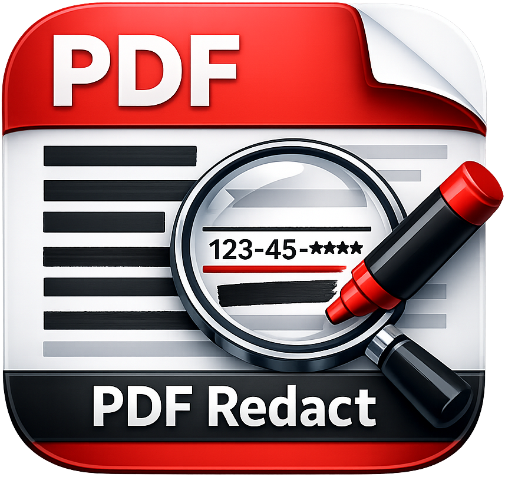
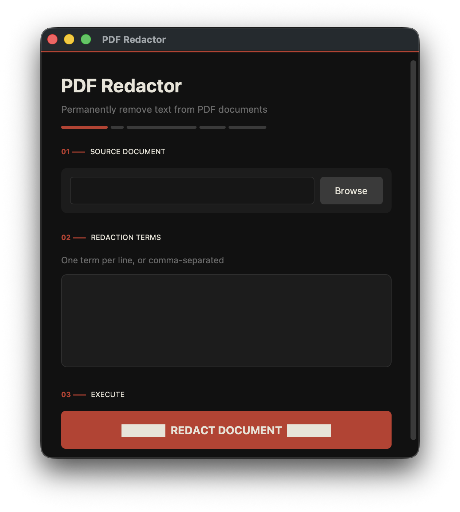

<div align="center">
  
  <h1>PDF Redactor</h1>
  <p><strong>Permanently remove sensitive text from PDF documents — not just hidden, truly gone.</strong></p>

  [](https://github.com/bytePatrol/PDF_Redact/releases/latest)
  [](LICENSE)
  [](https://www.python.org/)
  [](https://www.apple.com/macos/)

  <br>

  
</div>

---

## Overview

PDF Redactor is a native macOS application that **permanently and irrecoverably removes text** from PDF documents. Unlike tools that simply draw a black rectangle over text, PDF Redactor uses PyMuPDF's built-in redaction API to strip the underlying text data directly from the document's content stream — the redacted content cannot be recovered, copied, or searched for.

Perfect for legal professionals, healthcare providers, HR teams, or anyone who needs to share documents with sensitive information removed.

---

## Download

**[⬇ Download the latest release (.dmg)](https://github.com/bytePatrol/PDF_Redact/releases/latest)**

Open the `.dmg`, drag **PDF Redactor** into your Applications folder, and launch.

---

## Features

### Core Redaction
- **Irrecoverable removal** — text is deleted from the PDF content stream via PyMuPDF's `apply_redactions()`, not just visually covered
- **Multi-term support** — redact as many words, names, numbers, or phrases as needed in one pass
- **Flexible input** — enter terms one per line or comma-separated, in any combination
- **Automatic deduplication** — duplicate terms are silently ignored so results are clean
- **Case-aware search** — matches exactly as entered using MuPDF's native text search engine

### Native macOS App
- **Clean dark interface** — purpose-built UI with a clear three-step workflow
- **Native file dialogs** — standard macOS open/save sheets, not web file pickers
- **Smart output naming** — output file automatically named `<original>_redacted.pdf`
- **Shake feedback** — window shakes when required fields are empty

### Real-time Feedback
- **Live progress bar** — updates page-by-page as redaction processes
- **Background thread** — the UI stays fully responsive even on large documents
- **Per-term breakdown** — results show the exact match count for every term
- **Unmatched term warnings** — clearly flags terms that had zero matches

### Developer API
- **Importable library** — the redaction engine has zero GUI dependency, use it in any script
- **Progress callbacks** — receive page-by-page progress events from your own code
- **Structured results** — typed `RedactionResult` dataclass with a full redaction summary

---

## Installation

### Option A — App Bundle (Recommended)

1. Download **PDF Redactor.dmg** from the [Releases page](https://github.com/bytePatrol/PDF_Redact/releases/latest)
2. Open the DMG and drag **PDF Redactor** into `/Applications`
3. Install the Python package the app depends on:

```bash
pip3 install pdf-redactor
```

4. Launch from Applications or Spotlight

---

### Option B — Run from Source

```bash
git clone https://github.com/bytePatrol/PDF_Redact.git
cd PDF_Redact
pip3 install .
python3 -m pdf_redactor
```

---

## Usage

### GUI Application

1. **Select document** — click Browse to choose a PDF
2. **Enter redaction terms** — one per line or comma-separated
3. **Click REDACT DOCUMENT** — choose an output path in the save dialog
4. **Review results** — total matches removed, pages modified, and a per-term breakdown

### Python Library

The redaction engine can be used independently of the GUI in any Python script or pipeline:

```python
from pathlib import Path
from pdf_redactor import redact_pdf, parse_terms

# Parse terms from any string format
terms = parse_terms("John Smith, 123-45-6789\nconfidential@example.com")

# Run redaction with an optional progress callback
result = redact_pdf(
    input_path=Path("contract.pdf"),
    terms=terms,
    output_path=Path("contract_redacted.pdf"),     # optional
    fill_color=(0.0, 0.0, 0.0),                    # optional — defaults to black
    progress_callback=lambda cur, tot: print(f"{cur}/{tot}"),
)

print(f"Removed {result.total_matches} matches across {result.pages_modified}/{result.pages_total} pages")
print(f"Saved to: {result.output_path}")

if result.terms_not_found:
    print(f"No matches found for: {', '.join(result.terms_not_found)}")
```

#### `RedactionResult` fields

| Field | Type | Description |
|-------|------|-------------|
| `output_path` | `Path` | Where the redacted PDF was saved |
| `total_matches` | `int` | Total occurrences removed across all pages |
| `matches_per_term` | `dict[str, int]` | Per-term match counts |
| `pages_modified` | `int` | Pages containing at least one match |
| `pages_total` | `int` | Total pages in the document |
| `terms_not_found` | `list[str]` | Terms with zero matches |

---

## How It Works

PDF Redactor uses [PyMuPDF](https://pymupdf.readthedocs.io/) (the `fitz` binding for MuPDF) to process each page:

1. **Search** — `page.search_for(term)` locates all bounding rectangles for each term
2. **Annotate** — `page.add_redact_annot(rect, fill=(0,0,0))` marks each match with a redaction annotation
3. **Apply** — `page.apply_redactions()` renders the black fill **and permanently removes the underlying text** from the page content stream
4. **Save** — the modified document is written to the output path

The critical step is `apply_redactions()` — MuPDF's native redaction engine removes the text objects from the content stream entirely. The redacted content cannot be recovered by removing the rectangle, because it no longer exists in the file.

---

## Running Tests

```bash
pip3 install pytest
python3 -m pytest tests/ -v
```

---

## Building the DMG

To rebuild the macOS `.app` bundle and `.dmg` installer from source:

```bash
# Install build dependencies
pip3 install customtkinter pyobjc-framework-Cocoa Pillow

# Build (requires macOS + Xcode Command Line Tools)
bash build_dmg.sh
```

---

## Project Structure

```
src/pdf_redactor/
├── __init__.py      # Public API — redact_pdf, parse_terms, RedactionResult
├── __main__.py      # Entry point — python -m pdf_redactor
├── redactor.py      # Pure redaction engine (no GUI dependency)
├── gui.py           # Native macOS GUI (CustomTkinter)
└── web_gui.py       # Optional browser-based GUI (built-in HTTP server)
tests/
└── test_redactor.py # Unit tests for the redaction engine
build_dmg.sh         # Builds the macOS .app bundle and .dmg installer
```

---

## Requirements

| Component | Minimum Version |
|-----------|----------------|
| macOS | 12.0 |
| Python | 3.10 |
| PyMuPDF | 1.24.0 |
| CustomTkinter | 5.0.0 |

---

## License

[MIT](LICENSE)
